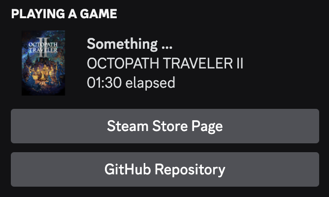

# Steam2Discord
A CLI application designed to enhance Discord activities on Linux. However, it can also be used to improve Discord activities on other platforms.



## Compatibility

The tool has been tested on Linux, Windows, and macOS.

## Usage

```
Usage: steam_2_discord [OPTIONS] --steamID <STEAM_ID> --steamAPI <STEAM_API_KEY>

Options:
      --steamID <STEAM_ID>
          Your Steam ID
      --steamAPI <STEAM_API_KEY>
          A Steam web API key
      --discordClient <DISCORD_CLIENT_ID>
          A Discord Client ID; not required, but can be used to add custom icons [default: 1104830381838057594]
  -h, --help
          Print help
```

You need to provide your Steam ID and a Steam web API key.
Your Steam ID can be found on [SteamDB](https://steamdb.info/), and you can get a Steam web API key with the following link: [https://steamcommunity.com/dev/apikey](https://steamcommunity.com/dev/apikey).

The application will automatically connect to your running Discord instance.
While running in the background, it will update your Discord presence according to the game currently being played on the Steam account associated with the provided Steam ID.

You can also create your own Discord application to add more game images. More information on how to do that is provided in the following section.

## Custom Images

As mentioned before, by creating your own Discord application and changing the Discord Client ID, you can add more images to be displayed.

Here are the steps required to add the images of games from your Steam library:

1. Go to [https://discord.com/developers/applications](https://discord.com/developers/applications) and log in.
2. Create a new application by clicking "New Application".
3. Choose a name (This name will be shown after "playing" in the Discord status).
4. Click on the application you just created.
5. In the left menu, click on "Rich Presence".
6. Add any images you like. The name of the images should be the same as their app ID.
7. After adding your images, click "Save Changes".
8. Now, click on "OAuth2" in the left menu.
9. Copy the Client ID.
10. Every time you run Steam2Discord, provide your Client ID using the `--discordClient` flag.

You can find images and app IDs on [SteamDB](https://steamdb.info/), but you can also use [SteamScraper](https://github.com/LennardKittner/SteamScraper), which can automatically download images for all the games in your Steam library.

## Building

You can build Steam2Discord like any other Rust application that uses Cargo:

```
cargo build --release
```

You can also download a pre-compiled version from [releases](https://github.com/LennardKittner/Steam2Discord/releases).

## FAQ

**Why do I need my own Steam web API key?**
There are a couple of reasons. I don't want to include my API key in the binary because it is hard to protect it from exfiltration. Another option would be to let the app connect to a proxy and forward the request with my API key. However, this would require me to host a server, and the Steam API rate limit could become a problem.

**If I don't have a domain, how do I get a Steam API key?**
I'm not sure, but I just used the URL of this repository, and it worked, so you could try to fork it and use that URL.

**Why does it always say "playing Something ..." instead of the real game name?**
The application name is "Something ...", and the Discord RPC interface doesn't allow dynamic application names. See [https://github.com/discord/discord-rpc/issues/375](https://github.com/discord/discord-rpc/issues/375).

**Why is nothing happening?**
Try running the application again, and if you are using your own Discord application, check the Client ID. Currently, a typo in the Client ID can't be detected.

**Why is the is there no image in Discord?**
If you are using the default Client ID it is likely that there is no image registered for that game. Discord applications can only have at most 300 images. To add more images, see the steps above.

If you are using another Client ID please wait a bit.
Discord sometimes takes some time until the image is visible.
If the image is still not showing, please check the name of the image.